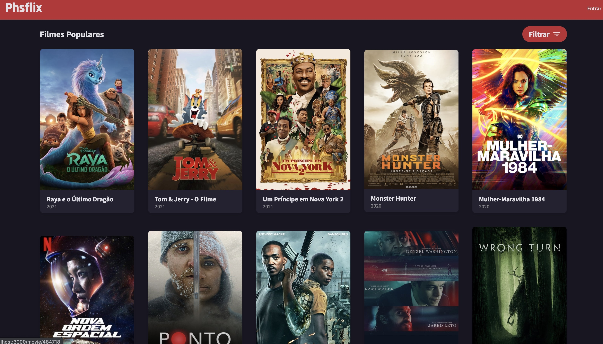

[](https://app.netlify.com/sites/phsflix/deploys)
[](https://phsflix.netlify.app/)

# Phsflix
_This project was built for a frontend challenge, it aims to list the most popular films of the day using the movie api [**The MovieDB v3**](https://developers.themoviedb.org/)._


## Screenshots
* Movie list


* Movie Detalis


## Getting Started
_The app uses node and react, to start it is necessary to have node.js installed_

### Start and Run
To start, install the project dependencies by running the command:
````
yarn install
or
npm install
````

To run project execute the command:
````
yarn start
or 
npm run start
````
